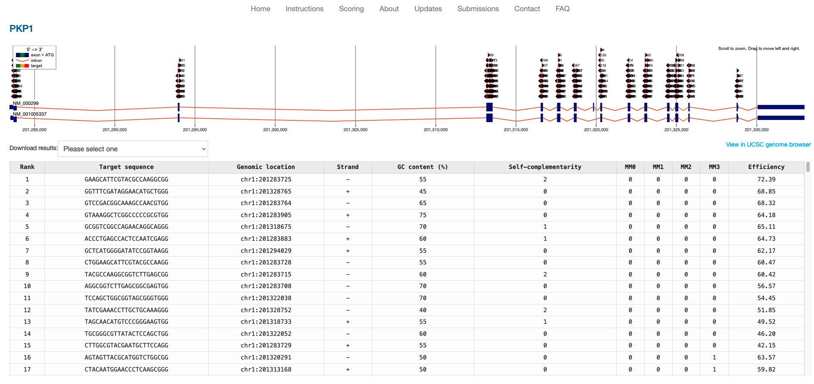

# CRISPR-Cas9 Guide Selection

## Objectives

- Generate a nextflow pipeline to bgzip the reference fasta, index the fasta, and 
extract a region by its coordinates.

- Use biopython to try to identify all possible potential guide RNAs in the PKP1
genomic locus
  
- Compare what you are able to find with the results from ChopChop


## Overview

We discussed CRISPR-Cas9 guide selection in lecture and now you will see the relatively
simply bioinformatics work that would enable you to determine the list of potential
guides to target Cas9 to a genomic region of interest. 

For this lab, remember that the standard Cas9 enzyme can be directed to cleave a target 
region in the genome with the following conditions:
  1. The region is a 20nt sequence
  2. This sequence is immediately followed by a PAM Motif (NGG)

Although there are other considerations that go into optimizing the selection of 
guide RNAs, these are the two basic requirements. 

There are more than a few guide selection algorithms readily available and behind the
scenes they all likely perform a few elementary bioinformatics operations you are 
already familiar with. 

The following is the output from one such tool, ChopChop, and lists all potential
guide RNAs to target the PKP1 gene in the human genome. 



## Provided Files
- GRCh38 Gencode Human Reference Genome
- BED file of the start/stop coordinates for all genes in the hg38 reference
- TSV and screenshot of results from ChopChop
- Nextflow modules

## Nextflow Activity

The goal of today is to use the provided modules to create a nextflow workflow that
bgzips the reference fasta file, creates an index using samtools, and extracts out a 
region of interest from the reference. This region of interest will be a particular
gene sequence for which we want to design a CRISPR guide 

I have setup each module to have a `stub` directive so you can use `-stub-run` to 
troubleshoot your workflow. All of the necessary files can also be found in your
`nextflow.config`. You can reference files by using their appropriate value in `params`.

## Workflow Specifications

Your workflow will need to do the following:

1. Convert the .gz file to a .bgz file - .bgz files are compressed files that can be indexed

1. Use the provided script to extract out the start and stop of the selected gene (NM_000299)
into a .txt file

2. Generate a FASTA index of the bgzipped genome

3. Extract out the sequence of NM_000299 using the FASTA, FASTA index and the .txt file with
the start and end position of NM_000299.

## BioPython Usage

1. Create a conda environment with the YML provided for you.

1. In your notebook, use Biopython to load in the extracted sequence and attempt to 
generate code that will identify every possible PAM and valid CRISPR Guide RNA
for the extracted sequence.

Similar to ChopChop, please also report the GC content % of each guide as well as
its starting position's genomic coordinates. 

I highly encourage you to use any resource available to you, including LLMs, stackoverflow,
or each other. 

Once you have identified your potential guides, you can compare them to those found in 
the `results/results.tsv` or the screenshot of guides found in this README. 

## Genome Browsers

We will walk through together how to open and view a genomic sequence and a BED file in
a genome browser. 

## Improvements

ChopChop is a tool intended primarily to design guides to generate gene knockouts. 
What is one major factor that we ignored? ChopChop did not ignore this feature of genes.

## Extra
1. If you have extra time, see if you can identify the sites on the (-) strand. 

2. Print out the chromosome, start and stop position of all of your guides into a .bed
file:

```
chr1	201283468	201283491
chr1	201283471	201283494
...
```

We will discuss this in the future but BED files are 0-based and most other formats are 1-based
indexes. Ensure that you adjust your start position appropriately in the BED. 

3. View your guides in a genome browser as I showed you for mine. 
